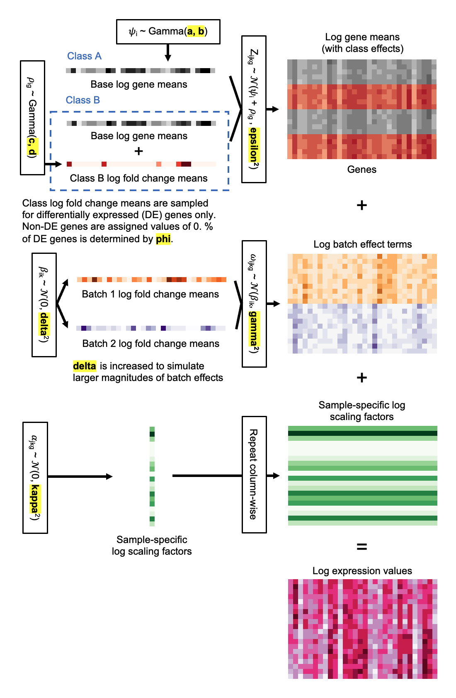
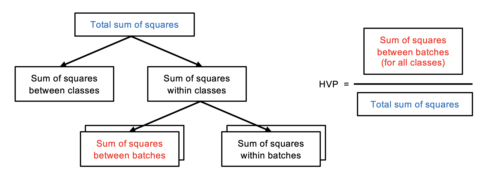
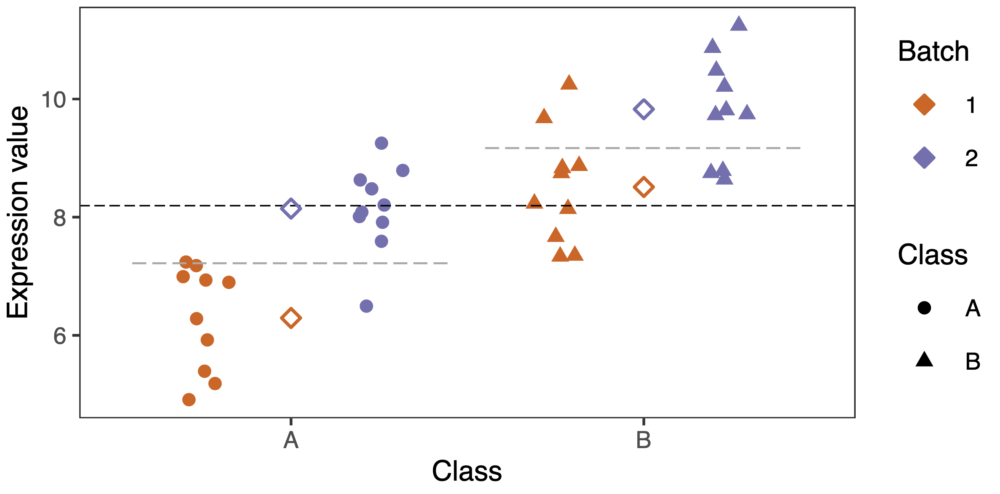

```{r v1, include = FALSE}
knitr::opts_chunk$set(
  collapse = TRUE,
  comment = "#>",
  eval = TRUE
)
```

# Introduction

Hierarchical variance partitioning (HVP) is a quantitative batch effect metric that estimates the proportion of variance associated with batch effects in a data set. HVP is suitable for use in all types of high-dimensional biological data, such as bulk gene expression, single-cell RNA-sequencing (scRNA-seq), and proteomics data. In addition, HVP can be used on both small and large data sets. HVP is designed to be robust to batch-class imbalance, where different batches have different proportions of classes. We implement `r BiocStyle::Githubpkg("dblux/HVP")` as an R package, with the main functionality of the package provided through the `HVP` function. `HVP` is developed to be compatible with existing Bioconductor classes (e.g. `SummarizedExperiment`, `SingleCellExperiment`) and the `Seurat` class for scRNA-seq analysis. `HVP` is intended for use on log-normalised data. In the following sections, we demonstrate how to use the `HVP` function to quantify batch effects. For details on how HVP works, please refer to the [theory](#theory) section.

# Installation

The `r BiocStyle::Githubpkg("dblux/HVP")` package can be installed from GitHub using the `r BiocStyle::CRANpkg("devtools")` package as follows:

```{r install, eval = FALSE}
# Install package: devtools if not present
if (!require("devtools", quietly = TRUE))
  install.packages("devtools")

devtools::install_github("dblux/HVP")
```

# Quick start

We show how to use the `HVP` function to quantify the magnitude of batch effects in a `matrix` object containing log-normalised gene expression values. First, we use the `simulateMicroarray` function provided in the `r BiocStyle::Githubpkg("dblux/HVP")` package to simulate gene expression data with three classes and two batches (see the [simulation](#simulation) section for further details). We indicate the batch-class design using a cross table with rows representing classes and columns representing batches, specifying the number of samples in each batch-class group in the corresponding cell of the table. After simulating the data, we provide the 1) `matrix` containing log-normalised expression values, along with the 2) batch information and 3) class information to the `HVP` function, which in turn returns a list containing two elements:

* **HVP**: The estimated proportion of variance associated with batch effects in the data set.

* **sum.squares**: A matrix of the sum of squares between batch and total sum of squares for all features.

```{r quickstart}
library(HVP)

crosstab <- matrix(10, 3, 2)
# Simulate microarray data with 100 features
data <- simulateMicroarray(crosstab, 100)

X <- data$X # matrix with dimensions (nfeature, nsamples)
batch <- data$metadata$batch # vector representing batch
class <- data$metadata$class # vector representing class

res <- HVP(X, batch, class)
res$HVP # proportion of variance attributable to batch effects
```

# Quantifying batch effects using HVP

The `HVP` function accepts as input objects from common classes that are used to store high-throughput biological data, such as the `SummarizedExperiment`, `SingleCellExperiment` and `Seurat`, in addition to base classes such as the `matrix` and `data.frame` classes. `HVP` is implemented as a S3 generic function that dispatches to different S3 class methods based on the class of the first argument `x`. The default S3 method is implemented for the classes `matrix` or `data.frame`, and S3 methods for `SummarizedExperiment`, `SingleCellExperiment` and `Seurat` have also been implemented. Users are free to implement their own S3 methods for other classes as well. We demonstrate below how to call the `HVP` function for objects of different classes. For array-like objects, please refer to the [quick start](#quick-start) section.

## Class: `SummarizedExperiment` / `SingleCellExperiment`

`HVP` is compatible with existing Bioconductor workflows, and accepts objects from the `SummarizedExperiment` class and its descendent classes, such as the `SingleCellExperiment` class. We simulate scRNA-seq data with batch effects using the `r BiocStyle::Biocpkg('splatter')` package:

``` {r sce, message = FALSE}
library(splatter)
library(scater)

params <- newSplatParams()
params <- setParams(
  params,
  nGenes = 100, # 100 features
  batchCells = c(150, 150), # Simulate 300 cells
  group.prob = c(0.5, 0.5),
  batch.facLoc = 0, # location parameter of log-normal distribution
  batch.facScale = 0.1 # scale parameter of log-normal distribution
)
sce_data <- splatSimulate(params, method = "groups")
sce_data <- logNormCounts(sce_data)
```

Applying the `HVP` function on a `SingleCellExperiment` object is straightforward, with sample metadata being stored in the `colData` slot of the `SingleCellExperiment` object. The arguments which need to be provided are:

* `x`: SingleCellExperiment object.

* `batchname`: name of column in metadata that indicates the batch of samples.

* `clsname`: name of the column/s in metadata indicating class information of samples.

``` {r HVP sce}
res_sce <- HVP(sce_data, "Batch", "Group")
```

## Class: `Seurat`

Similarly, `HVP` can be used to quantify batch effects in `Seurat` objects by providing it with the arguments: 

* `x`: Seurat object.

* `batchname`: name of column in metadata that indicates the batch of samples.

* `clsname`: name of the column/s in metadata indicating class information of samples.

```{r seurat, message = FALSE}
library(Seurat)

seurat_data <- as.Seurat(sce_data)
res_seurat <- HVP(seurat_data, "Batch", "Group")
```

# Testing the statistical significance of batch effects

To determine whether batch effects are statistically significant in a data set, a Monte Carlo permutation test can be performed by setting the optional argument `nperm` of the `HVP` function to the desired number of permutations. We recommend performing at least 1000 permutations. In each permutation, batch labels of the samples are permuted and a HVP value is subsequently computed. HVP values measured in all permutations are gathered to form a null distribution of HVP values. The $p$-value is calculated by dividing the number of permutations with a higher HVP value than the HVP value observed in the original data, by the total number of permutations. Running `HVP` with the permutation test option returns a list with two additional elements:

* **p.value**: p-value of the permutation test, i.e. the proportion of permutations with a larger HVP value than the observed HVP value of the original data.

* **null.distribution**: numeric vector containing the null distribution of HVP values.

``` {r perm, message = FALSE}
res_permtest <- HVP(X, batch, class, nperm = 1000)
res_permtest$p.value
```

We plot a histogram of the null distribution of HVP values obtained from the permutation test below and indicate the HVP value observed in the original data set as well.

```{r histogram, message = FALSE}
library(ggplot2)

null_distr <- data.frame(hvp = res_permtest$null.distribution)
nperm <- length(res_permtest$null.distribution)

ggplot(null_distr) +
  geom_histogram(
    aes(x = hvp), fill = "lightblue", col = "black", linewidth = 0.2
  ) +
  geom_vline(xintercept = res_permtest$HVP, col = "red") +
  theme(
    panel.grid.major = element_blank(),
    panel.grid.minor = element_blank()
  ) +
  labs(
    title = sprintf("Permutation null distribution (n = %d)", nperm),
    subtitle = "Data with batch effects",
    x = "HVP", y = "Count"
  ) +
  annotate(
    geom = "text", x = res_permtest$HVP - 0.01, y = 150,
    label = sprintf("Observed HVP (p = %.2f)", res_permtest$p.value),
    color = "red", cex = 2.7, angle = 90
  )
```

# Simulating microarray gene expression data {#simulation}

We propose a two-stage Bayesian hierarchical model to simulate log expression values of microarray gene expression data with batch and class effects, which is illustrated in the figure below. Our model simulates batch effects in all genes, and is able to simulate both additive and multiplicative batch effects (in log space).



We implement the proposed Bayesian hierarchical model as the `simulateMicroarray` function, which we include in the `r BiocStyle::Githubpkg("dblux/HVP")` package. At the moment, the `simulateMicroarray` function only has the option to simulate additive batch effects. Users are able to specify the magnitude of batch and class effects, percentage of differentially expressed genes, and other distribution parameters to simulate gene expression data tailored for their needs. The names of the optional arguments correspond to the distribution parameters (highlighted in yellow) in the figure above. Please refer to the documentation provided in R (`?simulateMicroarray`) for details on each parameter.

The `simulateMicroarray` function requires a cross table specifying the number of samples in each batch-class group to simulate. The rows and columns of the cross table are to correspond to classes and batches, respectively. We show how to simulate a data set with three classes and two batches, with ten samples in each batch-class group:

```{r simulate}
crosstab <- matrix(10, 3, 2)
crosstab

data <- simulateMicroarray(crosstab, 100) # 100 genes
names(data)
dim(data$X)
head(data$metadata)

X <- data$X
batch <- data$metadata$batch
class <- data$metadata$class
```

# HVP: Theory {#theory}

## Batch effects

Batch effects in gene expression data are generally modelled either as additive or multiplicative batch effects, or both [@lazar2012batch]. The popular batch effects correction method ComBat [@johnson2007adjusting] models batch effects as both additive and multiplicative batch effects as follows:

$$
Y_{ijk} = X_{ijk} + \delta_{ik} + \gamma_{ik}\epsilon_{ijk}
$$

where $Y_{ijk}$ is the measured log-transformed expression value for gene $i$ of sample $j$ from batch $k$, $X_{ijk}$ is the theoretical gene expression value, $\epsilon_{ijk}$ represents random Gaussian noise with mean zero and variance $\sigma^2_i$, and $\delta_{ik}$ and $\gamma_{ik}$ represents additive and multiplicative batch effects, respectively. Following the above model, additive batch effects can be visualised intuitively as the distance separating different batches of samples in a PCA plot of log-transformed data, while multiplicative batch effects can be visualised as clusters of samples from different batches having different levels of dispersion. 

## Hierarchical variance partitioning

HVP measures the proportion of variance associated with batch effects in a data set. It is based on the partition of sums of squares concept in the analysis of variance (ANOVA), where the total sum of squares is equals to the addition of sum of squares between groups and the sum of squares within groups. The total sum of squares can also be calculated by multiplying the variance of a group of samples by the number of samples less one.

We illustrate the concept of HVP in the figure below. First, classes are used as groups to partition the total sum of squares into sum of squares between classes and within classes. Subsequently, batches are used as groups to partition the sum of squares within each class into the sum of squares between batches and the sum of squares within batches. HVP is calculated by summing up the sum of squares between batches for all classes across all features, before dividing it by the total sum of squares across all features.



We visualise how the sum of squares between batches (across all classes) and the total sum of squares is calculated for a single feature in the figure below. The sum of squares between batches is computed for a class by taking the weighted sum of squared distances between the means of each batch-class group (orange and purple diamonds) and their respective class mean (grey dashed line). Subsequently, these values are summed across all classes with multiple batches. The total sum of squares is computed by taking the squared distance between each sample and the grand mean (black dashed line).



The hierarchical partitioning of the total sum of squares in HVP follows the hierarchical structure of the data, where differences in mean expression values between different classes exist (in differentially expressed genes), and additive batch effects manifest as differences in the mean expression values of samples from different batches within each class.

# Session info

```{r session}
sessionInfo()
```

# References
